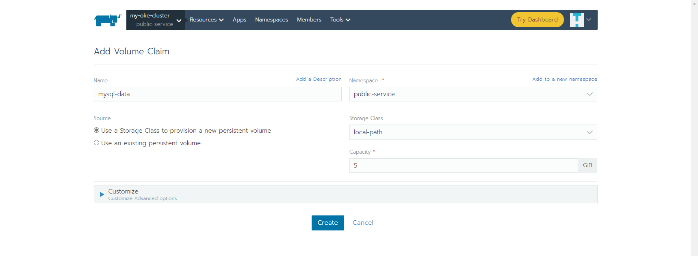

# Deploy Mysql 5.7 to Kubernetes Cluster by Rancher

### Add config

```
apiVersion: v1
data:
  mysqld.conf: |-
    [mysqld]
    pid-file        = /var/run/mysqld/mysqld.pid
    socket          = /var/run/mysqld/mysqld.sock
    datadir         = /var/lib/mysql
    #log-error      = /var/log/mysql/error.log
    # By default we only accept connections from localhost
    # bind-address   = 127.0.0.1
    # Disabling symbolic-links is recommended to prevent assorted security risks
    symbolic-links=0
    character-set-server=utf8
    lower_case_table_names=1
kind: ConfigMap
metadata:
  labels:
    app: mysql
  name: mysqld-config
  namespace: public-service
```

### Add Volumes



### Add Workloads

please change MYSQL_ROOT_PASSWORD and MYSQL_PASSWORD

```
## Service
apiVersion: v1
kind: Service
metadata:
  name: mysql
  labels:
    app: mysql
spec:
  type: NodePort
  ports:
  - name: mysql
    port: 3306
    nodePort: 30306
    targetPort: 3306
  selector:
    app: mysql
---
## Deployment
apiVersion: apps/v1
kind: Deployment
metadata:
  name: mysql
  labels:
    app: mysql
spec:
  replicas: 1
  selector:
    matchLabels:
      app: mysql
  template:
    metadata:
      labels:
        app: mysql
    spec:     
      containers:
      - name: mysql
        image: mysql:5.7
        ports:
        - containerPort: 3306
        env:
        - name: MYSQL_ROOT_PASSWORD
          value: password
        - name: MYSQL_DATABASE
          value: pdb1
        - name: MYSQL_USER
          value: pdbadmin
        - name: MYSQL_PASSWORD
          value: password
        resources:
          limits:
            cpu: 200m
            memory: 500Mi
          requests:
            cpu: 50m
            memory: 50Mi
        livenessProbe:
          tcpSocket:
            port: 3306
          initialDelaySeconds: 300
          timeoutSeconds: 1
          periodSeconds: 10
          successThreshold: 1
          failureThreshold: 3
        readinessProbe:
          tcpSocket:
            port: 3306
          initialDelaySeconds: 5
          timeoutSeconds: 1
          periodSeconds: 10
          successThreshold: 1
          failureThreshold: 3
        volumeMounts:
        - name: data
          mountPath: /var/run/mysqld
          subPath: mysqld
        - name: data
          mountPath: /var/lib/mysql
          subPath: mysql
        - name: data
          mountPath: /etc/mysql/conf.d
          subPath: conf.d
        - name: config
          mountPath:  /etc/mysql/mysql.conf.d
          subPath: mysqld.config
      volumes:
      - name: data
        persistentVolumeClaim:
          claimName: mysql-data
      - name: config      
        configMap:
          name: mysqld-config
```
